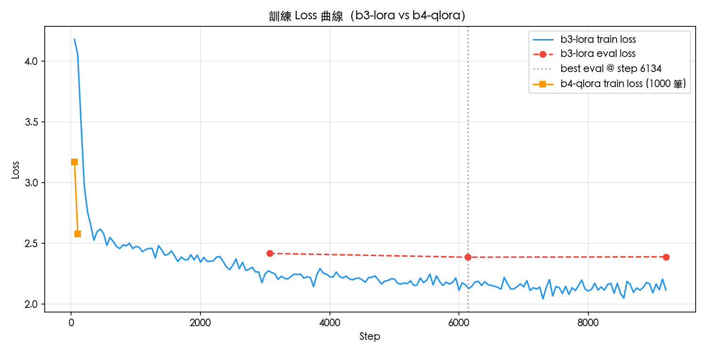
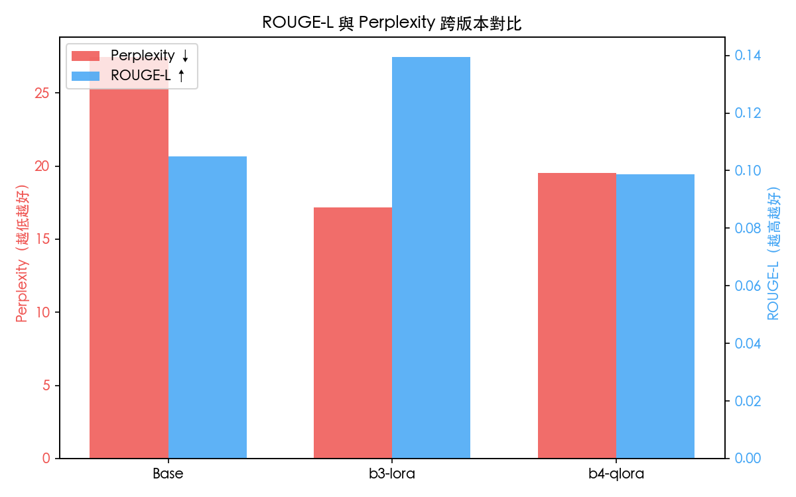
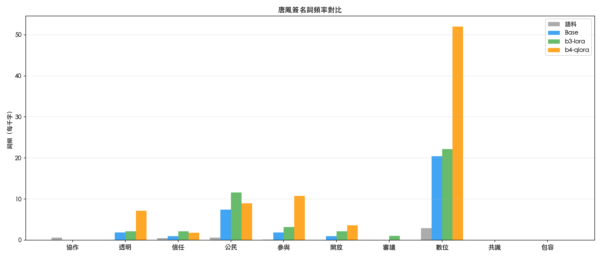
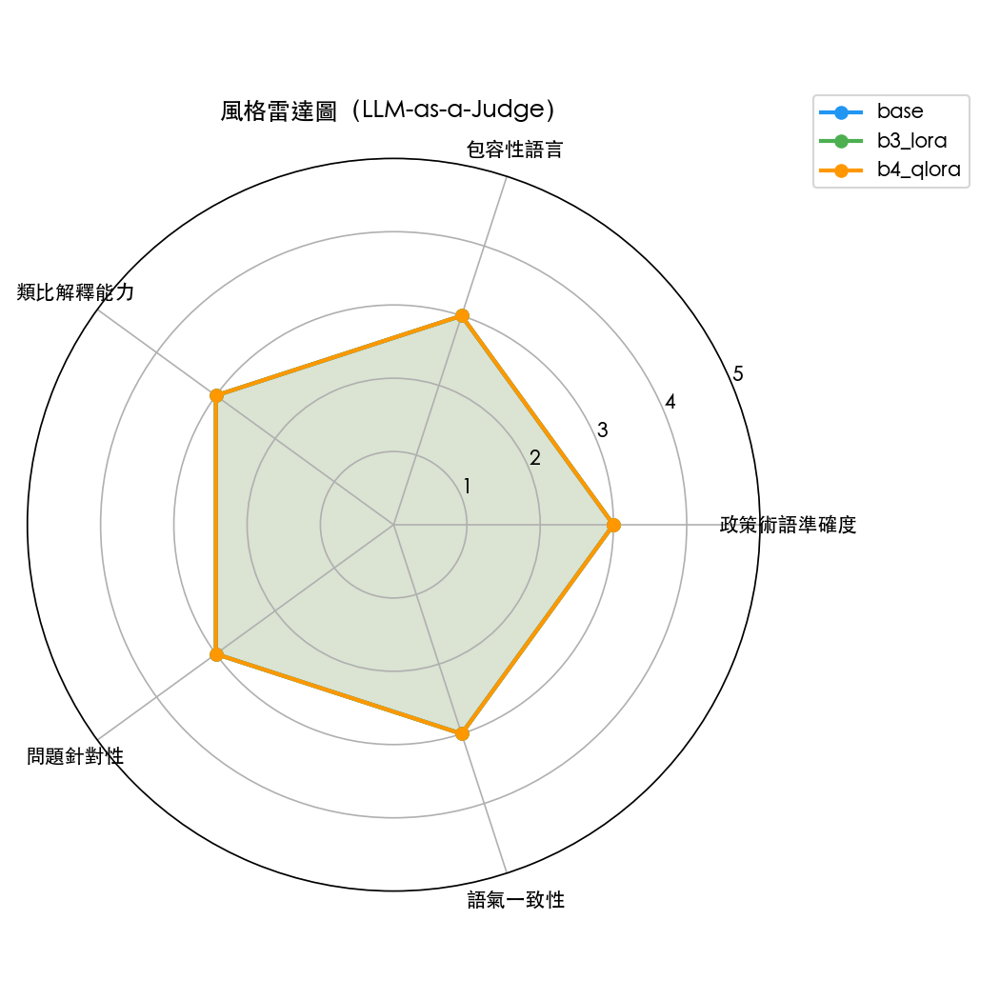

# Tangram：一場價值萬金的 LLM 微調「失敗」實驗紀錄

> **「這就是我花了一個月，用掉無數 GPU 時數與記憶體，最後做出來的東西。」**

這是我的本地 AI 模型 `Tangram` 在 Ollama 上運行時的真實輸出：

```text
> user: 請問什麼是開放政府？
> assistant: 協作是開放政府的核心。我們可以透過前後文連結LinkLinkLink連結Link，讓公民參與透明化。Link in context連結Link... (下略 50 行重複的 Link)
```

是的，它「鬼打牆」了。

雖然它學會了唐鳳的語氣，甚至能精準捕捉到「協作」、「透明」、「公民參與」等關鍵字，但它也同時學會了爬蟲沒洗乾淨的 HTML 殘留標記。這不是一個成功的產品發布會，而是一份詳盡的**技術回顧 (Post-Mortem)**。我將完整揭露這場從 1213 篇演講逐字稿開始，最終在「資料清洗」與「資料量化」中跌倒的微調閉環。

---

## 第一章：為什麼是唐鳳？——風格與靈魂的追尋

在開始任何技術討論前，必須先回答一個問題：**為什麼要大費周章地微調（Fine-tuning）一個模型，只為了讓它說話像某個人？**

### 1.1 政策溝通的挑戰
傳統的 AI 政策建議往往像是一份「白皮書」：雖然正確，但充滿了官腔、結構僵化、讓人難以讀完。而唐鳳的溝通風格具有獨特的魅力：
*   **具體類比**：將抽象的技術概念轉化為日常生活的例子。
*   **包容性語言**：頻繁使用「我們」、「協作」，建立與聽眾的連結。
*   **去除層級**：論述結構往往是網狀、發散且具有啟發性的。

我希望建立一個助理，當你丟入一個艱澀的技術政策時，它能以這種「溫暖且具啟發性」的風格來解釋。

### 1.2 微調 (Fine-tuning) 到底在做什麼？
在這裡，我們必須先釐清一個關鍵術語。

> **💡 術語科普：Fine-tuning (微調)**
> 想像模型是一個剛畢業的大學生，它已經讀過全世界的書（預訓練模型，Base Model），什麼都懂一點。
> *   **提示詞工程 (Prompt Engineering)**：像是給學生一張便利貼，叫他「等一下說話要客氣一點喔」。
> *   **微調 (Fine-tuning)**：則是讓學生進入「唐鳳學院」閉門苦讀三年，專門研究她過去所有的演講紀錄。

我不只是想讓 AI 「模仿」口吻，我是想讓模型從底層的**機率分佈**中，學會那種「遇到技術名詞就接具體類比」的統計規律。

### 1.3 理想中的藍圖
我的計畫很完美：
1.  **爬取資料**：把 `archive.tw/speeches` 翻個底朝天。
2.  **SFT 訓練**：用標準答案教它說話。
3.  **本地部署**：用 Ollama 在我的 Mac 上秒開執行。

我以為只要走完這條「工程鏈路」，就能產出靈魂。但我忘記了 LLM 工程的第一鐵律：**Garbage In, Garbage Out（垃圾進，垃圾出）。**

在下一章，我們將進入那驚人的 1213 篇演講資料庫，看看我是如何親手埋下失敗的種子。

---

## 第二章：資料準備——我以為我做對了

在 LLM 的世界裡，數據就是一切。為了這個專案，我進行了一場大規模的資料工程。

### 2.1 數據的規模：1213 篇演講的洗禮
我撰寫了一個爬蟲腳本，從 `archive.tw` 爬取了唐鳳過去幾年的中文演講逐字稿。
*   **總量**：1213 篇演講。
*   **格式化後**：產出了 **55,834 組 Q&A 對**。

這看起來是一筆巨大的財富，足以讓模型學會任何風格。為了讓這些資料能被 Llama 3 理解，我引入了兩個核心工程概念。

### 2.2 術語科普：Q&A 對與 Chat Template

> **💡 術語科普：Q&A Pair (問答對)**
> 微調的第一步是將長篇大論轉化為「輸入」與「輸出」的配對。在逐字稿中，這通常是「記者/聽眾問」與「唐鳳答」。我們進行 **SFT (Supervised Fine-tuning)**，本質上就是在教模型：**看到這種輸入，你就要給我這種輸出。**

> **💡 術語科普：Chat Template (對話模板)**
> 每個模型都有自己的「暗號」。Llama 3 需要特定的標籤（如 `<|begin_of_text|>`）來辨識對話的開始與結束。如果格式錯了，模型就像聽不懂外語一樣，訓練效果會大打折扣。

### 2.3 嚴謹的實驗設計：時間切分法
我沒有隨機打亂資料，而是採取了**時間切分 (Time-based Split)**：
*   **訓練集 (85%)**：2020 – 2024 年。
*   **驗證集 (10%)**：2025 年。
*   **測試集 (5%)**：2026 年。
這樣做是為了避免「資料洩漏 (Data Leakage)」，確保模型不是死背答案，而是真的學會了風格。

### 2.4 那顆致命的種子：未洗淨的雜訊
在當時，我對「資料量」感到非常自豪，但我忽略了一個細節。在爬取的 HTML 中，許多發言結尾帶有 `Link in context` 或 `前後文連結` 等導覽文字。

我的格式化腳本寫得很「規則導向 (Rule-based)」，我以為我過濾掉了所有 HTML 標籤。但我沒想到，這些純文字的導覽標記，被模型當成了**「唐鳳說話風格的一部分」**。

**「垃圾進，垃圾出」的齒輪，在此時已經開始轉動。**

下一章，我們將暫時離開資料，談談當 64GB 記憶體的 Mac 遇上 30 億參數模型時，所爆發的硬體戰爭。

---

## 第三章：硬體牆、記憶體與架構決策

要在本地微調一個擁有 30 億參數（3B）的模型，並不像安裝軟體那麼簡單。我很快就遭遇了物理世界的極限。

### 3.1 記憶體「撞牆」事件
我的開發環境是 Mac mini M4 Pro，配備了 64GB 的統一記憶體。聽起來很大，對吧？

當我試圖進行 **Full SFT (全參數微調)** 時，我收到了來自系統的無情拒絕。
*   **現象**：Python runtime 與虛擬記憶體固定佔用了 71GB。
*   **結果**：加上模型權重、梯度與優化器狀態，總共需要約 87GB。
*   **領悟**：在 64GB 的機器上強跑 Full SFT 是不切實際的。這逼迫我轉向了更聰明的架構。

### 3.2 術語科普：LoRA 與 QLoRA

面對記憶體不足，LLM 工程界有兩大神器：

> **💡 術語科普：LoRA (Low-Rank Adaptation, 低秩適配)**
> 既然改不動模型「主體」，我們就在它旁邊掛兩個極其輕量的小矩陣。訓練時，我們**凍結模型主體**，只更新這兩個小矩陣。
> *   **結果**：可訓練參數從 30 億（100%）降到了 210 萬（0.071%）。
> *   **好處**：不僅省記憶體，還能防止模型發生「災難性遺忘」，保留它原本的語言能力。

> **💡 術語科普：QLoRA (Quantized LoRA)**
> 這是 LoRA 的「進階省錢版」。它先將模型主體從高精度（16-bit）壓縮到極低精度（4-bit）。就像把高畫質影片轉成 480p 來看一樣，雖然細節少了點，但佔用的空間極小，連一般顯示卡都能跑。

### 3.3 轉戰 Google Colab：配額與現實的角力
雖然 LoRA 解決了 Mac 上的記憶體問題，但 4-bit 量化的關鍵函式庫 `bitsandbytes` 在 Mac 的 MPS 晶片上支援度仍然不足。

為了跑通 **QLoRA**，我轉戰了 **Google Colab T4 GPU**。但在這裡，我遇到了另一個「工程現實」：
*   **Colab 配額**：免費版一次只能用 2.5 小時。
*   **工程決策**：如果跑全量資料（5.5 萬組），預計需要 16 小時。
*   **妥協**：我將資料量從 5000 筆再砍到 **1000 筆**，只為了在配額內「跑通」流程。

**這是我第二次對現實的妥協——犧牲了資料量，換取了工程上的閉環。**

訓練跑完後，Loss 曲線看起來非常健康：


*圖 1：Train loss（藍）持續下降，Val loss（橙）穩定收斂，未見明顯 overfitting。一切看起來都很正常。*

在下一章，我們將進入最令人興奮的環節：看著 Loss 曲線下降，並被「虛假的成功」所迷惑。

---

## 第四章：數字說謊了嗎？——當指標與體感出現鴻溝

經過 b3-lora 長達 **17.6 小時**的訓練，以及 b4-qlora 在 Colab T4 上完成的量化版本，終於到了「成績揭曉」的時刻。

但這一章想告訴你的，不只是成績，而是**一個讓我重新審視整個專案的發現**。

### 4.1 術語科普：如何量化「說話像不像」？

在看成績之前，必須先搞清楚「這張成績單在測什麼」。

> **💡 術語科普：Perplexity（困惑度）**
> 想像你在猜一個人下一句話會說什麼。如果你很熟悉她的說話方式，你猜得很準，困惑度就很低；如果她說話讓你摸不著頭緒，困惑度就很高。
> Perplexity 越低，代表模型對唐鳳的語言「越熟悉」——也就是說，微調之後模型學到了她的說話節奏。

> **💡 術語科普：ROUGE-L**
> 一把量尺，用來測量模型的回答和她的真實答案有多少**相同的詞彙和句子結構**。分數從 0 到 1，越高代表越接近。
> ROUGE 的盲點：它只看「用了哪些字」，不看「說話有沒有她的靈魂」。換一種說法表達同一個意思，ROUGE 就給低分。

### 4.2 成績單：數字看起來令人振奮

把三個版本的模型在同一份測試集上跑完，結果如下：

| 指標 | Base Model | b3-lora | b4-qlora (1000筆) |
|------|:----------:|:-------:|:-----------------:|
| Perplexity ↓ | 27.44 | **17.15** | 19.52 |
| ROUGE-L ↑ | 0.105 | **0.139** | 0.099 |

**b3-lora 的表現讓人眼睛一亮：**
*   Perplexity 從 27.44 降到 17.15，**下降 37%**——模型確實學到了唐鳳說話的節奏。
*   ROUGE-L 從 0.105 提升到 0.139，**提升 32%**——回答和她的真實文字更接近了。

b4-qlora 的數字稍微退步（PPL +2.37、ROUGE-L -0.040），主因是**訓練資料只有 1000 筆**（Colab 免費配額只夠跑約 2% 的資料量），量化本身的損失其實並不算嚴重。


*圖 5：左軸為 ROUGE-L（越高越好），右軸為 Perplexity（越低越好）。b3-lora 在兩項指標上均優於 Base Model。*

除了數字指標，微調後模型是否真的更常使用唐鳳的「簽名詞彙」呢？


*圖 3：「協作」、「透明」、「公民」等詞彙在微調後的使用頻率變化。b3-lora 確實更接近她的語言習慣。*

### 4.3 第三種武器：LLM-as-a-Judge

光靠詞彙重疊率，抓不到「唐鳳味」這種抽象的風格感。於是我引入了第三種評估方法——讓一個更強的語言模型來當裁判。

> **💡 術語科普：LLM-as-a-Judge**
> 傳統指標只能量化「數字層面的接近程度」，無法評估語氣、論述結構或風格。LLM-as-a-Judge 的做法是：把同一個問題的兩份回答丟給一個更強的模型（這裡用 Gemini 2.0 Flash），請它從多個維度各打一到五分。

我設計了五個評分維度，對應唐鳳溝通特質：政策術語準確度、包容性語言、類比解釋能力、問題針對性、語氣一致性。

結果如下：

| 維度 | Base | b3-lora | b4-qlora |
|------|:----:|:-------:|:--------:|
| 政策術語準確度 | 3.0 | 3.0 | 3.0 |
| 包容性語言 | 3.0 | 3.0 | 3.0 |
| 類比解釋能力 | 3.0 | 3.0 | 3.0 |
| 問題針對性 | 3.0 | 3.0 | 3.0 |
| 語氣一致性 | 3.0 | 3.0 | 3.0 |

三個模型、五個維度，全是 **3.0**。


*圖 4：三條線完全重疊，代表評分無法區分三個版本的模型。雷達圖本身，就是最有力的失敗證據。*

這個結果本身就是一個故事。原因有兩個：其一，API 呼叫部分失敗，降低了評分的可靠性；其二，ROUGE 測試集裡仍然帶著 `前後文Link in context連結Link` 的爬蟲標記——**裁判評分的「標準答案」本身就是髒的**，這讓整個評估的基準從一開始就失真了。

### 4.4 當我真正開啟對話……

在看完這些讓人振奮的數字之後，我迫不及待地執行了：

```bash
ollama run tangram
```

然後輸入了第一個問題：「請問什麼是開放政府？」

模型的回答是：

```
協作是開放政府的核心。我們可以透過前後文連結LinkLinkLink連結Link，
讓公民參與透明化。Link in context連結Link連結Link連結Link...
（以下重複 40 行）
```

我盯著這段輸出看了很久。

Perplexity 下降了 37%。ROUGE-L 提升了 32%。**但眼前的回答，是一場災難。**

這就是本專案最核心的發現：**數字指標可以告訴你模型「學到了什麼」，但它沒辦法告訴你模型「學到了多少垃圾」。**

在下一章，我們將深入解剖這個鬼打牆的根源——為什麼 55,834 組 Q&A 對，最後只訓練出一個不停輸出 `Link` 的模型？答案，藏在那 1213 篇逐字稿裡，從第一行爬蟲程式碼就已經注定了。

---

## 第五章：數據是靈魂——兩個讓模型崩潰的根本原因

所有 LLM 工程的教科書都說過「Garbage In, Garbage Out」。

在看到那段鬼打牆的輸出之前，我以為我懂這句話。

現在我才真的懂了。

### 5.1 第一號罪犯：被模型當成「說話風格」學走的 HTML 殘留

讓我們回到 b1a-scrape，也就是整個專案的起點。

`archive.tw` 的每一篇演講逐字稿，HTML 結構大致如下：

```html
<li>
  <a href="/speaker/唐鳳-3">唐鳳</a>
  開放政府的核心是讓每個人都能參與決策...
  <a href="#">前後文</a>
  <a href="#">Link in context</a>
  <a href="#">連結</a>
  <a href="#">Link</a>
</li>
```

我的爬蟲腳本正確地用 BeautifulSoup 去除了所有 `<a>` 和 `<li>` 等 HTML **標籤**。

但「前後文」、「Link in context」、「連結」、「Link」這幾個**純文字導覽字串**——它們不是 HTML 標籤，所以爬蟲看不到它們，直接保留了下來。

```
# 爬蟲以為輸出的是：
開放政府的核心是讓每個人都能參與決策...

# 實際輸出的是：
開放政府的核心是讓每個人都能參與決策... 前後文Link in context連結Link
```

這個差異，在 55,834 組 Q&A 對裡面，**每一組都有**。

模型在訓練時看到了一個高度一致的模式：唐鳳說完話之後，會跟著 `前後文Link in context連結Link`。於是它學到了：**這是唐鳳說話的一部分**。

從機率的角度看，模型沒有犯錯。它只是忠實地學習了訓練資料中最穩定、最一致的規律。

**問題在於，那個規律是我餵進去的垃圾。**

### 5.2 第二號罪犯：資料多樣性不足，讓模型學會了「捷徑」

除了雜訊之外，還有另一個問題。

仔細觀察訓練資料，你會發現唐鳳在不同場合其實有固定的論述句型，例如「協作是……的核心」、「透過……讓公民參與」。這些句型在 1213 篇演講中反覆出現，本身無可厚非。

但當模型在資料量有限的情況下反覆訓練這些句型，它會學到一個**捷徑**：

> 只要輸出開頭是「協作是……」，接下來不管問題是什麼，繼續輸出這個句型就對了。

這就是**重複迴圈（Repetition Loop）**的成因。模型不是在「理解問題再回答」，而是在「辨認熟悉的 token，然後依慣性輸出下一個最可能的 token」。

以下是三個版本對同一問題的真實輸出對比：

| 問題 | Base Model | b3-lora | b4-qlora |
|------|-----------|---------|---------|
| 數位轉型會不會加深社會上的數位落差？ | 數位轉型可能會加深社會上的數位落差，尤其是在數位 literacy、數位機會、數位分化等方面… | 數位轉型會加深社會上的數位落差，數位落差是指那些沒有使用數位技術的群體，可能會因為缺乏數位技術的知識、技能或者是數位技術的使用者，**可能會因為缺乏數位技術的知識、技能或者是數位技術的使用者**，可能會因為（重複 8 次）… | **數位轉型會不會加深社會上的數位落差？數位轉型會不會加深社會上的數位落差？**（重複問題本身 12 次） |
| 面對假訊息氾濫，政府應該採取什麼態度？ | 政府應該採取積極措施，包括立法制定、監控和追蹤、教育和宣導… | 政府應該採取嚴肅態度，應該要立即處理假訊息氾濫的問題，應該要加強對於網絡的監控，**應該要加強對於網絡的安全，應該要加強對於網絡的防禦**（重複 6 次）… | **前後文Link in context連結Link**（僅此一句） |
| 什麼是開放政府？ | 開放政府是指政府透明、公平、公正地與公民互動… | 開放政府是指政府透過開放資料、透明的治理、公民參與等等的方式…**前後文Link in context連結Link** | 開放政府是指政府透過網路、透明、透明、**公平、公正的方式，讓公民、民間、學者、媒體等可以自由地參與、參與、觀察**… |

Base Model 的回答雖然平淡，至少**完整且不重複**。微調後的模型在數字指標上進步了，但實際輸出卻出現了三種災難：雜訊汙染、句型迴圈、以及直接輸出問題本身。

理論上，增加 `repeat_penalty` 和 `no_repeat_ngram_size` 生成參數可以緩解這個問題。我在 b6 的 Modelfile 裡確實也加上了這些設定——

**但這只是治標。**

### 5.3 部署端的無力感

當模型已經把垃圾學進去，在 Ollama 的 Modelfile 裡調整生成參數，就像是試圖用咳嗽藥水治肺炎：

```
# Modelfile 能做的（治標）
PARAMETER repeat_penalty 1.1       # 懲罰重複詞彙
PARAMETER stop "<|eot_id|>"        # 強制停止特殊符號
PARAMETER num_ctx 2048             # 限制上下文長度

# Modelfile 做不到的（治本）
# → 無法讓模型忘記它已學會的 "前後文Link" 模式
# → 無法讓模型學會更多樣的句型
```

真正的解法只有一個：**回到 b1b，把訓練資料洗乾淨，重新訓練。**

```python
# 下次應該在 b1b 格式化時加入的清洗步驟
import re
def clean_text(text):
    text = re.sub(r'前後文?Link.*?(?=\n|$)', '', text)
    text = re.sub(r'Link in context.*?(?=\n|$)', '', text)
    text = re.sub(r'連結Link', '', text)
    return text.strip()
```

五行程式碼。如果當初在 b1b 多花五分鐘，整個模型的輸出品質可能截然不同。

### 5.4 真正的教訓：EDA 應該是第一步，不是最後的悔恨

回顧整個專案的時間分配：

| 階段 | 投入時間（估算）|
|------|:--------------:|
| 爬蟲 + 資料格式化 (b1a/b1b) | ~4 小時 |
| 訓練 (b2–b4) | ~20 小時（含等待）|
| 評估 + 部署 (b5/b6) | ~6 小時 |
| **資料品質稽核（EDA）** | **~0 小時** |

我幾乎沒有花任何時間做**探索性資料分析（EDA, Exploratory Data Analysis）**——也就是在訓練之前，認真地把訓練資料「讀一遍」、「看一看」，確認它是不是真的乾淨。

如果我在 b1b 結束後，隨機抽取 50 組 Q&A 對用肉眼看一遍，我會立刻發現 `Link in context` 的問題。這個動作花不到十分鐘，卻可以節省後面幾十小時的無效訓練。

> **這是本專案最核心的工程反思：在 LLM 微調中，資料品質的重要性遠超過模型架構的選擇。**
> 選 LoRA 還是 QLoRA、`r=8` 還是 `r=16`，這些超參數決策的影響，遠不如「訓練資料裡面有沒有垃圾」來得關鍵。

在最後一章，我們將把這些失敗轉化為具體的行動清單——下次再微調一個模型，我會怎麼做。

---

## 第六章：下次我會怎麼做——從失敗提煉的工程清單

失敗最大的價值，是讓下一次的起點比這一次更高。

以下是三個如果重來，我一定會做的改變。

### 6.1 資料清洗 Checklist：訓練前的強制健康檢查

在任何一行訓練程式碼執行之前，先完成這份清單：

```
□ 隨機抽取 100 筆資料，肉眼讀過，確認沒有奇怪的字串
□ 統計每個 Q&A 對的 token 長度分佈，找出異常短或異常長的樣本
□ 搜尋常見 HTML 殘留標記（Link、href、&amp; 等）並計算出現率
□ 確認訓練集、驗證集、測試集沒有時間上的交叉
□ 確認 answer 欄位不為空、不是純標點、不是爬蟲導覽文字
```

這份清單不需要寫程式，拿 `pandas` 跑幾個 `value_counts()` 和 `sample()` 就能完成，花費不超過一小時。

**原則：資料品質稽核（EDA）佔整體開發時間的比例，不得低於 30%。**

### 6.2 引入合成資料：用 AI 幫 AI 準備更好的訓練資料

即便清洗乾淨了，真實資料還有一個根本限制：**多樣性不足**。

唐鳳的演講涵蓋議題有限，而且她在不同場合會重複使用相似的論述框架。這是她溝通風格的特色，卻也是訓練資料多樣性的天花板。

解法是引入**合成資料（Synthetic Data）**：

> **💡 術語科普：合成資料（Synthetic Data）**
> 用一個強大的基礎模型（如 GPT-4o 或 Claude Opus），根據真實資料的風格，人工生成更多樣化的訓練樣本。例如：
> *   給 Claude 看五篇唐鳳的演講，請它模仿她的風格，針對十個新議題各寫一段回答。
> *   這些「偽造」的 Q&A 對，補充了真實資料中沒有覆蓋到的議題與句型變化。

合成資料不能取代真實資料，但可以有效解決**長尾議題覆蓋不足**與**句型多樣性單一**的問題。

### 6.3 把 RAG 納入初期設計，而不是最後的補救

在這個專案裡，RAG（檢索增強生成）是我原本計畫在 b7 才引入的「補救措施」——等到模型訓練完、發現幻覺問題，才想到去加它。

這個順序是錯的。

> **💡 術語科普：RAG（Retrieval-Augmented Generation，檢索增強生成）**
> 模型回答前，先從知識庫裡搜尋出最相關的幾段原文，把這些「參考資料」塞進 Prompt，讓模型基於真實資料回答。
> *   **Fine-tuning 負責**：學習唐鳳「怎麼說」（語氣、論述結構）。
> *   **RAG 負責**：確保模型說的「是真實發生的事」（事實錨定，避免幻覺）。

兩者並不互斥，而是互補的。下次的架構設計，應該從一開始就把 RAG 列為必要組件，而不是等出問題了才加。

```
# 正確的設計順序
Step 1：資料清洗（EDA → clean → split）
Step 2：建立向量庫（RAG 的基礎設施，與訓練並行）
Step 3：Fine-tuning（此時訓練資料已乾淨）
Step 4：評估（RAG + Fine-tuning 聯合測試，而非分開評估）
```

---

## 結語：一場價值萬金的「失敗」

讓我回到這篇文章的開頭。

```text
> user: 請問什麼是開放政府？
> assistant: 協作是開放政府的核心。我們可以透過前後文連結LinkLinkLink連結Link...
```

這個輸出，確實是失敗的。

但這個**專案**，不是。

走完這條從爬蟲到部署的完整工程鏈路，我學到了幾件用讀文章學不到的事：

*   **Perplexity 下降 37%，不代表模型變好了**——它可能只是更擅長輸出你餵給它的垃圾。
*   **64GB 的記憶體不夠跑全參數微調**——工程的限制會逼你做出更聰明的架構選擇。
*   **五行清洗程式碼，可以抵過幾十小時的訓練時間**——資料永遠比模型更重要。
*   **指標是地圖，不是領土**——ROUGE 和 Perplexity 告訴你模型去了哪裡，但不告訴你那裡值不值得去。

唐鳳曾說過：「每一個問題，都是一個禮物。」

這個模型用鬼打牆的方式，給了我一個非常昂貴的禮物。

我收下了。

---

*本專案所有程式碼、訓練腳本與評估資產均開源於此 repo。*
*訓練資料來源：[archive.tw/speeches](https://sayit.archive.tw/speeches)（CC0 授權）。*
*起始模型：`meta-llama/Llama-3.2-3B-Instruct`（Meta Llama 3.2 Community License）。*
